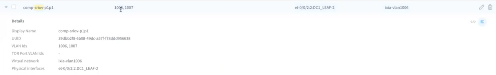
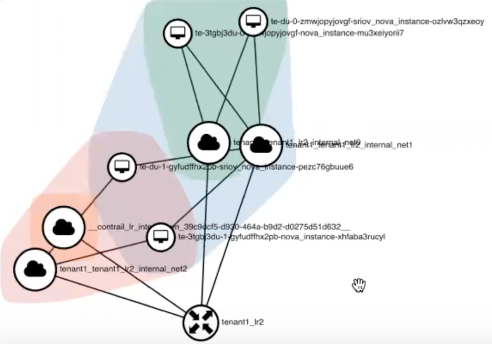

# Automation of SRIOV VMs and Kernel VMs interconnection

## Introduction

The aim of this POC is to demonstrate how creation of VMs connected to Kernel vRouter and SRIOV vRouter can be automated using heat and Ansible as well as to demonstrate following reachability usecases:

 - Within the same VN
 - Inter VN
 - Inter tenant

Creation of VMs connected to SRIOV vRouter implies they are connected to the Port Group on the Fabric that is also configured by the same automation framework that is used to create those VM. Environment for demonstrating this is OpenStack + Contrail installed by CC13.1 that was onboarded into CFM 1908.

Automation framework is represented by Ansible that is installed on the host that cat reach OpenStack API.

For the network infrastructure we don't need to specify every single prefix for subnets, VLANs, VN names, they get created using yaql expressions in heat templates. We only need to specify base parameters that are used for yaql expression evaluations. To implement loops in heat `OS::Heat::ResourceGroup` resource is used and `yaql` is used to normalise its output to make it consumable by other heat resources.

## Project layout

```./sriov_stack/
├── README.md
├── heat                               <<< Collection of heat templates
│   ├── complete_stack.yaml            <<< Entry point template for normal LR
│   ├── complete_stack_ext.yaml        <<< Entry point template for external LR
│   ├── networks_stack_contrail.yaml   <<< Entry point template to network configuration
│   ├── sec_group_stack.yaml           <<< Creation of security group
│   ├── single_net.yaml                <<< Used by networks_stack_contrail.yaml
│   └── single_server.yaml             <<< Used by complete_stack*.yaml
├── images
│   └── vm_interconnection.png
├── lr_create.yaml                    <<< Ansible playbook to create whole heat stack
├── lr_destroy.yaml                   <<< Ansible playbook to destroy whole heat stack
├── main.yaml                         <<< Playbook serving as point into the whole automation
├── tenant_create.yaml                <<< Creation of openstack projects
└── tenant_destroy.yaml               <<< Deletion of openstack projects and cleanup of stacks
```

## Prerequisites

In order to run this from laptop, it's recommended to initiate a python virtual environment with following packages installed:
```
(shade) dzhigalin@dzhigalin-mbp$ pip freeze
appdirs==1.4.3
asn1crypto==0.24.0
certifi==2019.9.11
cffi==1.12.3
chardet==3.0.4
cryptography==2.7
decorator==4.4.0
dogpile.cache==0.7.1
idna==2.8
iso8601==0.1.12
jmespath==0.9.4
jsonpatch==1.24
jsonpointer==2.0
keystoneauth1==3.17.1
munch==2.3.2
netifaces==0.10.9
openstacksdk==0.35.0
os-client-config==1.33.0
os-service-types==1.7.0
pbr==5.4.3
pycparser==2.19
PyYAML==5.1.2
requests==2.22.0
requestsexceptions==1.4.0
shade==1.32.0
six==1.12.0
stevedore==1.31.0
urllib3==1.25.3
```

Among those packages `shade` is a prerequisite for using os_heat and other os_* ansible modules.

It also assumes that image and flavor specified in the `vars` section of `main.yaml` were created before execution of playbook. Node scheduling is acheived by specifying host aggregates, that were also created outside of this automation.

It also assumes that Virtual Port Group is already created for that SRIOV host (althoug it's also possible to automate it, this was not demonstrated by this POC). Here's the representation of this configuration in Contrail Command WebUI.




*Note that this VLANs 1006,1007, displayed on the picture, are note related to this demonstration. VLANs needed to segregate different VMs on the same port start from 1300 and are not displayed here*

That is also the reason why switch port profile and VPG are hardcoded into the heat template. To achieve flexibility to change them they should be converted to parameters.

Below is the snippet from `heat/single_net.yaml` where this is happening.
```
- virtual_machine_interface_bindings_key_value_pair_key: "profile"
  virtual_machine_interface_bindings_key_value_pair_value: "{\"local_link_information\":[{\"port_id\":\"et-0/0/2_2\",\"switch_id\":\"et-0/0/2_2\",\"switch_info\":\"DC1_LEAF-2\",\"fabric\":\"dc1\"}]}"
- virtual_machine_interface_bindings_key_value_pair_key: "vif_type"
  virtual_machine_interface_bindings_key_value_pair_value: "vrouter"
- virtual_machine_interface_bindings_key_value_pair_key: "vpg"
  virtual_machine_interface_bindings_key_value_pair_value: "comp-sriov-p1p1"
```

## Execution

With all prerequisites met, playbook should be executed with op key `create`

To trigger creation of heat stacks, run:
```
ansible-playbook main.yaml -e op=create
```

## Results

Here's the representation of created network in Horizon



As we see here, during the demonstration 4 VMs were created. This was controlled by setting `count` variable to 2. Each VM is connected to 2 VNs. Each of the VNs is created with its own unique segmentation id starting from 1300, that's where VLAN numbers in VPG are coming from. Those segmentation IDs were created automatically and configured on the fabric port due to the fact that we created `fabric_vmi` for each of the networks. This allows VMs to communicate within the same VN they are connected to. The fact that they are connected to LR allows VMs from different networks talk to each other. Provided that VMs from different tenants are connected to networks that are connected to "external" LRs of their tenants, they will be able to talk to each other.
